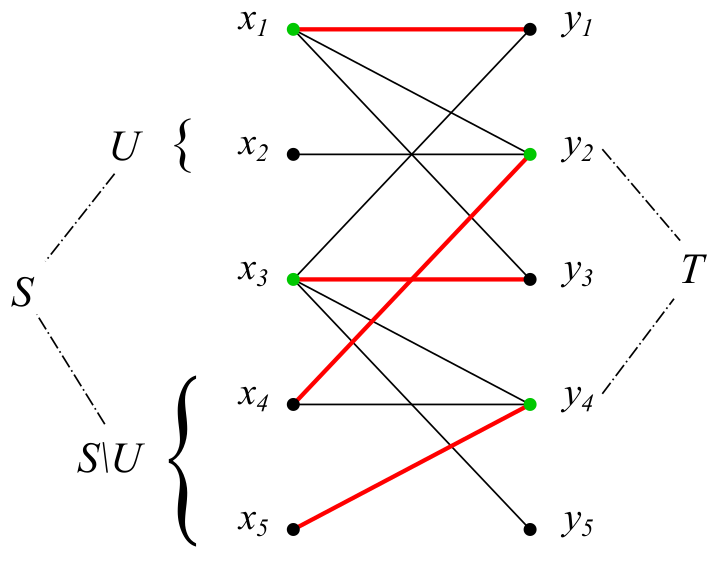

# Комбинаторика

## Множества

**Мультимножество** над $n$-элементным множеством $X$ -- это пара $(X, \varphi)$, где $\varphi: X \rightarrow \mathbb{Z}$ есть функция, каждому элементу множества сопоставляющая его количество вхождений в мультимножество.

1. $k$-сочетанием без повторений называется любое $k$-элементное подмножество n-элементного множества;
2. $k$-сочетанием с повторениями называется любое $k$-мультимножество над n-множеством;
3. $k$-перестановкой без повторений называется упорядоченное $k$-подмножество n-элементного множества;
4. $k$-перестановкой с повторениями называется любой элемент декартовой степени $X$ $k$.

**Правило суммы:** $|A\cup B| = |A| + |B| - |A\cap B|$

**Принцип включения-исключения:** $|A'\cap B'| = |X| - |A| - |B| + |A\cap B|$

## Комбинаторные формулки

**Биномиальный коэффицент:** ${n\choose k} = \frac{n!}{k!(n-k)!}$ -- выбрать $k$ элементов из $n$ без повторений

${n\choose k} = {n - 1\choose k - 1} + {n-1 \choose k}$
${n\choose k} = 0$ при $k > n$
${n\choose 0} = 1$ для $\forall n \geq 0$

Свойства:

${n\choose k} = {n \choose n - k}$
${k\choose k} + {k+1\choose k} + ... + {n \choose k} = {n+1\choose k+1}$
${n+m\choose k} = \sum\limits_{i=0}^k{n\choose i}\cdot{m \choose k-i}$ -- тождество Вандермонта
$\sum\limits_{k=0}^n{n\choose k} = 2^n$
$\sum\limits_{k=0}^n(-1)^k{n\choose k}=0$
$\sum\limits_{k=1}^nk{n\choose k} = n\cdot 2^{n-1}$

**Выбрать с повторениями:** $\left(\!\!{n\choose k}\!\!\right) = {n+k-1 \choose k}$

### Перестановки

$k$-перестановок с повторениями $n^k$ штук.

$k$-перестановок без повторений $P(n, k) = n\cdot(n-1)\cdot...\cdot(n-k+1) = (n)_ k$ штук

$(q)_ k = q^{\underline{k}} = q\cdot(q-1)\cdot...\cdot(q-k+1)$ -- убывающая факториальная степень
$q^{(k)} = q^{\overline{k}} = q\cdot(q+1)\cdot...\cdot(q+k-1)$ -- возрастающая факториальная степень

$\left(\!\!{n\choose k}\!\!\right) = {n+k-1 \choose k} = \frac{n^{(k)}}{k!}$

### Задача о урне

Есть урна, содержащая $n$ <i>различных</i> предметов. Из урны последовательно вытаскивается $k$ предметов. Задача заключается в подсчете числа различных выборок.
Есть четыре модификации:
*  - предметы возвращаются в урну -- <i>выборка с повторениями</i>
    - предметы не возвращаются в урну -- <i>выборка без повторений</i>
* важен ли порядок предметов (<i>упорядоченные</i> и <i>неупорядоченные</i>).

| Предметы на выходе | с возвращением                      | без возвращения |
|:-------------------|:------------------------------------|:----------------|
| упорядоченнные     | $n^k$                               | $(n)_k$         |
| неупорядоченнные   | $\left(\!\!{n\choose k}\!\!\right)$ | $n\choose k$    |

### Числа Стрилинга

* Инъекция -- у каждого элемента не более одного прообраза
* Сюрьекция -- у каждого элемента хотя бы один прообраз
* Биекция -- у каждого элемента ровно один прообраз

Число сюрьективных отображений $n$-элементного множества в $k$-элементное множество $\widehat{S}(n, k)$

Число всех отображений через число сюрьективных: $k^n = \sum\limits_{i=0}^k{k\choose i}\widehat{S}(n, i)=\sum\limits_{i=0}^n{k\choose i}\widehat{S}(n, i)$

Отсюда $\widehat{S}(n, k) = \sum\limits_{i=0}^k(-1)^{k-i}{k\choose i}\cdot i^n$

Пусть $S(n, k)$ -- число неупорядоченных разбиений $n$-множества на $k$ блоков.
$S(n, k) = \frac1{k!}\widehat{S}(n, k) = \frac1{k!}\sum\limits_{i=0}^k(-1)^{k-i}{k\choose i}\cdot i^n$ -- числа Стирлинга 2-го рода

$S(n,k) = S(n-1,k-1)+k\cdot S(n-1, k)$

$B(n, k) = \sum\limits_{i=1}^kS(n,i)$.
Числа Белла $B_n=B(n,n)$ -- число <i>всех</i> возможных разбиений $n$-элементного множества $X$.

Разложение $n$ предметов по $k$ ящикам:

| Предметы ($X$) | Ящики ($Y$)  | Любое число предметов в ящике       | Не более 1-го предмета в ящике | Как минимум 1 предмет в ящике |
|:---------------|:-------------|:------------------------------------|:-------------------------------|:------------------------------|
| различимые     | различимые   | $k^n$                               | $(k)_n$                        | $\widehat{S}(n, k)$           |
| неразличимые   | различимые   | $\left(\!\!{n\choose k}\!\!\right)$ | $k\choose n$                   | $n-1\choose k-1$              |
| различимые     | неразличимые | $B(n,k)$                            | $0,\ n > k$ $1,\ n \leq k$  | $S(n,k)$                      |

## Рекуррентные соотношения

### Числа Каталана

$C_0 = 1$
$C_n = \sum\limits_{k=1}^nC_{k-1}C_{n-k}$

# Графы

## Базовые определения и теоремы

**Диаметр графа** -- максимальное расстояние между вершинами графа, $diam(G) = \max\limits_{x, y\in V(G)}d(x,y)$

**Эксцентриситет вершины** -- максимальное расстояние от данной вершины до всех остальных, $\epsilon(x) = \max\limits_{y\in V(G)}d(x,y)$

**Радиус графа** -- минимальный из эксцентриситетов всех вершин графа $G$. Вершины, на которых этот минимум достигается, называются центральными вершинами графа $G$.

**Обхват графа** -- длина наименьшего цикла в графе.

### Теорема Кенига

**Теорема:** Граф $G$ является двудольным тогда и только тогда, когда в нем отсутствуют циклы нечетной длины (так называемые нечетные циклы).

**Доказательство:** То, что в любом двудольном графе нечетные циклы отсутствуют, достаточно очевидно. Действительно, для того, чтобы, выйдя из произвольной вершины $x$ блока $X$, затем в нее же и вернуться, нам необходимо сделать четное число шагов. Следовательно, любой цикл в двудольном графе $G[X, Y]$ обязан иметь четную длину.

Предположим теперь, что в графе G циклы нечетной длины отсутствуют. Сразу заметим, что при доказательстве нам достаточно ограничиться связными графами — любой несвязный граф является двудольным тогда и только тогда, когда двудольной является любая из его компонентсвязности. Кроме того, мы можем считать, что граф $G$ построен на $n > 1$ вершинах — в случае $n = 1$ граф $G = K_1$ по определению является двудольным.

Выберем в $G$ произвольную вершину $x \in V(G)$ и разобъем множество $V(G)$ вершин на два блока. К блоку $Y$ отнесем все вершины $y \in V(G)$, для которых длина кратчайшего пути из $z$ в $y$ нечетна, а к блоку $X$ отнесем все оставшиеся вершины. В частности, сама вершина $x$ принадлежит блоку $X$, а все смежные с ней вершины принадлежат подмножеству $Y$. Докажем, что любые две вершины $x_p$, $x_q$ из подмножества $X$ смежными не являются (см. рис).

Рассмотрим для этого произвольные кратчайшие пути $P$ и $Q$, соединяющие эти вершины с вершиной $x$. Обозначим через $z \in V(G)$ последнюю общую вершину этих путей. Вершина $z$ разделяет пути $P$ и $Q$ на два подпути — участки $P_1$ и $Q_1$ этих путей от $x$ до вершины $z$, а также подпути $P_2$ и $Q_2$ , соединяющие $z$ с вершинами $x_p$ и $x_q$ соответственно. Сразу заметим, что длины путей $P_1$ и $Q_1$ обязаны совпадать — в противном случае мы могли бы сократить путь от $x$ до одной из двух вершин $x_p$, $x_q$, что невозможно. Кроме того, так как $x_p$ и $x_q$ принадлежат блоку $X$, длины путей $P$ и $Q$ имеют одинаковую четность. Как следствие, одинаковую четность имеют и участки $P_2$ и $Q_2$ путей $P$ и $Q$. Кроме того, $P_2$ и $Q_2$ не имеют никаких других общих вершин, помимо $z$. Добавление к ним ребра $e = {x_p, x_q}$ приводит к образованию в $G$ цикла нечетной длины, чего быть не может.

Аналогично доказывается, что и любые две вершины $y_p,\ y_q \in Y$ смежными не являются. Следовательно, граф $G$ является двудольным.

## Связность

**Остовный подграф** -- подграф, полученный из исходного только удалением ребер.

**Индуцированный подграф** -- подграф, полученный из исходного только удалением вершин.

**k-фактор графа** -- остовный $k$-регулярный подграф.

**Утверждение:** Вершина $x$ в связном графе $G$, построенном на $n > 3$ вершинах, есть точка сочленения графа $G$ тогда и только тогда, когда в $G$ существуют отличные от $x$ вершины $y$ и $z$, такие, что $x$ содержится в каждом пути из $y$ в $z$.

**Утверждение:** Ребро $e = {x, y}$ в простом связном графе $G$ является мостом тогда и только тогда, когда $e$ не принадлежит ни одному из циклов графа $G$.

## Изоморфизмы

**Изоморфизм** -- перестановка вершин, переводящая помеченный граф в другой такой же

**Автоморфизм** -- перестановка вершин, переводящая помеченный граф в себя же

Число различных помеченных графов, получаемых из непомеченного графа $G_1$: $N = \frac{n!}{|Aut(G_1)|}$

**Симметричный граф** -- граф, группа автоморфизмов которого тривиальна.

## Деревья

**Цепью** в частично упорядоченном множестве $P$ называется подмножество множества $P$ , любые два элемента которого сравнимы между собой, а **антицепью** — подмножество, любые два элемента которого не сравнимы между собой.

**Теорема (Dilworth, 1950):** В любом конечном частично упорядоченном множестве $P$ найдется такое разбиение множества $P$ на цепи $P_i$, $i = 1, . . . , k$, количество $k$ которых совпадает с количеством элементов в некоторой антицепи $A$.

**Теорема (Mirsky, 1971):** В любом конечном частично упорядоченном множестве $P$ найдется такое разбиение множества $P$ на антицепи $A_j$, $j = 1, . . . , m$, количество $m$ блоков в котором совпадает с длиной самой длинной цепи в $P$.

**Нормальное остовное дереве** -- это остовное дерево, у которого (в исходном графе) нет перекрестных ребер. DFS строит как раз такое дерево.

### Формула Кэли

Число различных помеченых деревьях на $n$ врешинах равно $a_n=n^{n-2}$.

Код Прюфера -- последовательность чисел $P(T)=(y_1, y_2, ..., y_{n-2})$, одназначно сопоставляемая дереву $T$. На каждом шаге берем лист с минимальным номером, удаляем его, в последовательность записываем номер вершины, с которой этот лист был соединен.

**Доказательство однозначности сопоставления:**
1. Листья в последовательности не встречаются (очевидно)
2. Люая вершина $x$ встречается в последовательности ровно $deg_T(x) - 1$ раз (тоже очевидно)
3. **Восстановление:** добавим к последовательности $(y1, y2, ..., y_{n-2})$ вторую последовательность $(x1, x2, ..., x_{n-2})$ номеров вершин, которые мы удалаяем. По первой, с учетом того, что удаляется лист с минимальным номером, легко восстанавливается вторая (и сами ребра $(x_i, y_i)$).

## Эйлеровы циклы

*Эйлеров цикл* -- цикл, проходящий единожды по всем ребрам графа (вершины могут повторяться).
*Эйлеров путь* -- аналогичный путь.

**Теорема:** в графе существует эйлеров цикл тогда и только когда, когда нетривиальных (содержащих больше, чем одну вершину) компонент связности не больше одной, и все вершины имеют четную степень.
**Доказательство:** в одну сторону очевидно. В другую: идем из какой-нибудь вершины до тех пор, пока не войдем в нее же (это так, т.к. все вершины четные, и из вершины всегда можно выйти). Получим замкнутый путь $C_1$. Либо $C_1$ совпадает с графом (тогда все хорошо), либо не совпадает. Тогда возьмем разность $G-C_1$, там аналогичным образом найдем $C_2$ и т.д. Т.к. все происходит в одной компоненте связности, то все найденные $C_1...C_k$ можно объединить в один путь (цикл), который и даст нам искомый эйлеров.

**Теорема:** эйлеров путь в графе существует тогда и только когда ровно у двух вершин степень нечетная.
**Доказательство:** добавим еще одну вершину, соединим ее с нечетными вершинами. Получим эйлеров граф.

**Теорема:** орграф является эйлеровым тогда и только тогда, когда для любой вершины $outdeg(x) = indeg(x)$.

**BEST теорема:** количество $e(D)$ эйлеровых путей в оргафе $D$ расчитывается по формуле $e(D) = T^-(D, x)\cdot\prod\limits_{y\in D}(outdeg(y)-1)!$, где $x$ -- произвольная вершина $D$, а $t^-(D, x)$ -- количество корневых остовных деревьев, все ребра которых направлены к корню в вершине $x$.

**Фишка:** пусть $e_1,...,e_n$ -- эйлеров цикл в орграфе. Зафиксируем некоторую вершину $x$. Если для всех остальных вершин выбрать исходящее ребро с максимальным номером (в порядке цикла), то получится остовное дерево с корнем в $x$.

### Последовательность де Брейна

Задача: найти наименьшую циклическую последовательность (циклическое слово) над алфавитом из $n$ букв, содержащую все возможные подстроки длины $k$ (так называемые $k$-меры).
Пример: $B(2, 3)$. Алфавит длины два ($0$ и $1$), слова длины три. $B(2,3)=00011101$ (по кругу). Последовательность не может быть короче, чем $n^k\ \Rightarrow$ (благодоря де Брейну) существует такая последовательность длины $n^k$.

Как такую последовательность получить:
1. Сложно. Строим граф, где вершины -- все возможные $k$-меры. Проводим ребро от вершины $v$ к вершине $u$, если $v[1:] - u[:k-1]$ (хвост вершины $v$ является префиксом вершины $u$). Дальше ищем гамильтонов цикл и, бинго, получаем нужную последовательность.
    
2. Просто. Строим граф, где вершины -- все возможные $k-1$-меры. Соединяем вершины $v$ и $u$, если существует $k$-мер, у которого $v$ -- префикс, а $u$ -- суффикс. Таким образом, каждому ребру будет соответствовать $k$-мер. Дальше ищем эйлеров цикл и, бинго, получаем последовательность.
    

## Гамильтоновы циклы

*Гамильтонов цикл* -- цикл, проходящий единожды по всем вершинам.

*Гамильтонов путь* -- путь, проходящий единожды по всем вершинам.

### Необходимые условия для цикла

1. Отсутствие вершин степени 1
2. Количество $k=c(G-S)$ компонент связности $U_1,...,U_k$, получающихся в результате удаления некоторого в результате удаления вершин некоторого непустого множества $S\subset V(G)$ графа $G$ не превосходит количества удаленных вершин. $c(G-S)\leq |S|$
    **Доказательство:** если есть цикл, то из одной компоненты в другой можно пройти только через вершины множества $S$. Очевидно, можно идти только по таким вершинам $\Rightarrow$ компонент связности не больше этих вершин.

### Достаточные условия для цикла

1. Пусть в графе существует гамильтонов путь $P=x_1,...,x_n$, соединяющий вершины $x_1$ и $x_n$. Достаточным условием для существования гамильтонова цикла в таком графе является выполнение следующего неравнества: $deg(x_1) + deg(x_n)\geq n$.
    **Доказательство:**
    
    Идея в том, что в пути $P$ есть ребро $e=(x_i, x_{i+1})$, такое, что существуют ребра $(x_1, x_{i+1})$ и $(x_i, x_n)$.
    **Более общий факт:**
    Если есть путь $P=x_1,...,x_k$ и $deg(x_1)+deg(x_k)\geq k$, то существует цикл, проходящий через все вершины $P$.
2. **Теорме Оре:** если для любых двух несмежных вершин $x$ и $y$ графа $G$ выполняется $deg(x) + deg(y)\geq n-1$, то гамильтонов путь существует.
    **Доказательство:** во-первых, граф $G$ связен, и кратчайший путь между любыми двумя вершинами $\leq 2$.
    Предположим, что гамильтонова пути в графе $G$ нет $\Rightarrow$ наидлиннейший кратчайший путь между какими-то вершинами $P$ содержит $k<n$ вершин $\Rightarrow$ в графе существует простой цикл $C$ длины $k$.
    Так как $k < n$ и граф $G$ связен, то в $G$ обязана существовать вершина y, не входящая в цикл $C$ и смежная хотя бы с одной из вершин $x = x_1$ этого цикла $C = (x_1 , . . . , x_k$ ). Но в таком случаемы всегда можем построить в графе $G$ простой путь $y, x_1 , x_2 , . . . , x_k$ длины, большей, чем $k$, что противоречит предположению о том, что $P$ есть путь максимальной длины. Полученное противоречие доказывает теорему.

**Следствия теоремы Оре:**
1. Если для любой парф несмежных вершин $deg(x) + deg(y) \geq n$, то в $G$ существует гамильтонов цикл.
2. Если степень любой вершины $\geq \frac{n-1}2$, то в графе существует гамильтонов путь, если $\geq \frac n2$, то существует цикл.

## Вершинная и реберная связность

**Реберная связяность** $\lambda(G)$ -- минимальное число ребер, которые надо удалить, чтобы граф стал несвязным.

Граф называется реберно $k$-связным, если он остается связным при удалении любого числа ребер $<k$.

**Вершинно разделяющее множество**, оно же **вершинный разрез** -- множество вершин $S\subset V(G)$ такое, что $G-S$ -- несвязный, либо содержит только одну вершину.

**Вершинная связяность** $\kappa(G)$ -- минимальное число вершин, которые надо удалить, чтобы граф стал несвязным, или имел только одну вершину.

Минимальная степень, среди всех вершин обозначается как $\delta(G)$.

**Теорема:** для любого графа верно неравенство $\kappa(G)\leq\lambda(G)\leq\delta(G)$
**Доказательство:** простое, аккуратно удаляем ребра до тех пор, пока не остается моста, далее удаляем мост.

## Двусвязные графы

Два ребра называются **похожими**, если они либо совпадают, либо они входят в один простой цикл.

**Лемма:** отношение похожести является отношением эквивалентности.

Отношение похожести разбивает множество ребер $E(G)$ на классы эквивалентности, называемые блоками. Блоки отделены друг от друга либо мостами, либо точками сочленения.

**Теорема:** пусть $G$ есть связный граф, построенный на $n > 3$ вершинах. Следующие три утверждения равносильны:
1. граф $G$ является двусвязным
2. любые два ребра этого графа принадлежат некоторому циклу $C$
3. для любых двух вершин графа $G$ существует цикл $C$, проходящий через эти вершины.
**Доказательство:**
* $1\Rightarrow 2$: любые два ребра, инцидентные одной вершине лежат в цикле $\Rightarrow$ они похожи $\Rightarrow$ все ребра похожи
* $2\Rightarrow 3$: у любых двух вершин есть ребра, они лежат на цикле $\Rightarrow$ эти вершины лежат в цикле
* $3\Rightarrow 1$: допустим, что есть точка сочленения $\Rightarrow$ противоречие пункту $2$

Любой граф точками сочленения разбивается на блоки (по ребрам) и точки сочленения. Граф блоков и точек сочленения $B(G)$ является деревом (очевидно, двудольным).

### Алгоритм поиска точек сочленения

Обходим граф в глубину, считаем функцию

$f_{up}(v) = \min(t_{in}(v), t_{in}(p), f_{up}(to))$, где $t_{in}(v)$ -- время захода в вершину $v$, $v$ -- текущая вершина, $(v, p)$ -- обратное ребро, $(v, to)$ -- прямое ребро в дереве.
Функция $f_{up}$ олицетворяет минимальное время захода в вершину, достижимую из данной. Если есть точка сочленения, то из всех ее потомков можно дойти только до нее, выше никак.
Таким образом, если для какого-то ребра в дереве $(v, to)$ $f_{up}(to)\geq t_{in}(v)$, то $v$ -- точка сочленения (если $v$ не корень дерева). Корень дерева является точкой сочленения, если у него больше одного потомка.

### Разложение на ручки

Выделяем в графе цикл. Далее выделяем петли, концы которых висят на цикле и уже выделенном графе.

**Теорема:** граф $G$ является двусвязным тогда и только тогда, когда он допускает разложение на ручки.
* $\Rightarrow$: выделяем цикл, далее, пока не получили исходный граф, всегда будет находиться пара ребер, одно из которых принадлежит выделенному графу, а второе нет. Они лежат в цикле $\Rightarrow$ можно добавить ручку.
* $\Leftarrow$: цикл двусвязный. Добавление ручки связность не нарушает.

### Реберно двусвязный граф

Любой вершинно двусвязный граф является реберно двусвязным, но не наоборот.

Реберно двусвязный граф раскладывается на ручки, с замкнутыми ручками (ручка начинается и заканчивается в одной и той же вершине).

## k-связные графы

### Теорема Менгера

**Теорема:** $x,\ y$ -- две несмежные вершины графа $G$. Тогда количество $\kappa(x, y)$ вершин в наименьшем вершинном разделяющем множестве совпадает с наибольшим количеством непересекающихся простых путей и $x$  в $y$.

**Путь между множествами** $X, Y$ -- это такой путь, что его начало $\in X$, а конец $\in Y$ (если множества пересекаются, то путь состоит из одной вершины).

Множество $R$ **отделяет** множество $X$ от множества $Y$, если любой путь из $X$ в $Y$ роходит через $R$.

**Теорема:** пусть $X$, $Y$ — пара подмножеств множества $V(G)$. Тогда количество $k$ вершин в минимальном отделяющем $X$ от $Y$ множестве $R$ совпадает с максимальным количеством $l$ попарно непересекающихся друг с другом путей из $X$ в $Y$.

**Доказательство:** сложное, см. конспект (стр. 108)

**Доказательство теоремы Менгера:** возьмем вершины $x$ и $y$. Пусть $X$ -- вершины смежные с $x$, $Y$ -- вершины, смежные с $y$. Размер минимального отедляющего множества $X$ от $Y$ совпадает с $\kappa(x, y)\ \Rightarrow$ по теореме существует $\kappa(x, y)$ неперсекающихся путей.

### Теорема Уитни

**Теорема:** граф $G$ является $k$-связным тогда и только тогда, когда между любыми двумя его вершинами существует $k$ путей, не имеющих общих внутренних вершин.

**Доказательство:**
В одну сторону очевидно.
В другую (связен $\Rightarrow$ есть пути):
Рассмотрим вершины $x$ и $y$:
1. $x$ и $y$ несмежны $\Rightarrow$ по т. Менгера есть $k$ путей
2. $x$ и $y$ смежны, есть ребро $e=(x,y)$. Покажем, что связность графа $\kappa(G-e)$ меньше $\kappa(G)$ не более, чем на единицу. Если у нас равенство, то все ок. Иначе рассмотим вершинно разделяющее множество $S$ графа $G-e$, такое, что $|S|=\kappa(G-e)$, рассмотрим $G-S$, там будет мост $e$, и там все получится.

## Теорема Форда-Фалкерсона

**Сеть** -- взвешенный орграф с положительными весами, а также стоком и истоком, $c(x, y)$ -- пропускная способность ребра $(x, y)$.

$(S, T)$ -- разбиение всех вершин сети на два блока, такое, что в $S$ лежит исток, а в $T$ -- сток. Ребра между этими множествами -- $(S, T)$ разрез сети, сумма их весов -- пропускная способность разреза.

**Лемма:** для любого потока $f$ в сети $D$ и произвольного $(S, T)$ разреза в ней верно, что $val(f)\leq cap(S, T)$
**Доказательство:** более-менее очевидно, из $S$  в $T$ не может протечь больше, чем позволяет разрез.

**Теорема Форда-Фалкерсона:** в любой сети величина максимального потока совпадает с величиной минимального разреза.
**Доказательство:** допустим, есть поток $f$. Превратим сеть в неорграф, в множества $S$ положим все вершины, достижимые из $s$ по ребрам, либо прямым, но ненасыщенным, либо обратным, но ненулевым. Дальше оказывается, что любое ребро из $S$ в $T$ является насыщенным, а обратное -- нулевым $\Rightarrow$ поток в точности равен величине разреза.

**Алгоритм нахождения максимального потока:** берем нулевой поток, потом начинаем искать простые пути из истока в сток, и дополнять их до максимальных.

## Паросочетания в графах

 *Паросочетание** $M$ -- набор ребер графа, не имеющих общих концевых вершин.

 **Совершенное паросочетание** -- паросочетание, покрывающее все вершины графа.

 **Максимальное паросочетание** -- наибольшее паросочетание.

**Наибольшее по включению паросочетание** -- такое паросочетание, что больше к нему ребер не добавить

 **M-чередующийся путь** -- путь, в котором чередуются ребра, принадлежащие и непринадлежащие паросочетанию $M$

 **M-дополняющий путь** -- $M$-чередующийся путь, в котором первое и последнее ребро не принадлежит паросочетанию.

### Теорема Бержа

 **Теорема:** паросочетание $M$ является максимальным тогда и только тогда, когда $M$-дополняющие пути в графе отсутствуют
 **Доказательство:**
 Предположим, что $M$ -- немаксимальное паросочетание $\Rightarrow$ надо доказать, что существует дополняющий путь. Расмотрим симм. разность $F=M\Delta M'$ ($M'$ -- максимальное паросочетание), и пограф $H$, индуцированный ребрами из $F$. Он состоит из путей и циклов. В циклах одинаковое число ребер из $M$ и $M'$, в путях их либо одинаково, либо ребер из $M'$ на единичку больше $\Rightarrow$ это $M$-дополняющий путь.

### Покрытия

**Вершинное покрытие** -- множество вершин, покрывающее все ребра

**Реберное покрытие:** -- множество ребер, покрывающее все вершины

**Вершинно-независимое множество** -- множество вершин, попарно несмежных между собой

**Обозначения:**
* $\alpha(G)$ -- размер наибольшего вершинно-независимого множества
* $\alpha'(G)$ -- размер наибольшего паросочетания
* $\beta(G)$ --размер минимального вершинного покрытия
* $\beta'(G)$ -- размер минимального реберного покрытия

**Лемма о слабой двойственности:** размер произвольного паросочетания не превосходит размера произвольного вершинного покрытия. В частности, $\alpha'(G)\leq\beta(G)$

**Лемма о слабой двойственности:** размер произвольного вершинно-независимого множества не превосходит размера произвольного реберного покрытия. В частности, $\alpha(G)\leq\beta'(G)$

*Клика* -- полный подграф данного графа. $\omega(G)$ -- размер наибольшей клики. $\omega(G)=\alpha(\overline{G})$

**Теорема:** $\alpha(G) + \beta(G) = n$
**Доказательство:** доказываем два нестрогих неравенства, получаем равенство

**Лемма:** остовный подграф $H$, порожденный минимальным реберным покрытием представляет из себя лес, в котором каждое дерево является звездой

**Теорема Галаи:** $\alpha'(G) + \beta'(G) = n$
**Доказательство:** доказываем два нестрогих неравенства, получаем равенство

## Паросочетания в двудольных графах

**Теорема Кенига-Эгервари:** в двудольном графе $\alpha'(G)=\beta(G)$
**Доказательство:** добавим по вершине, соединенные с каждыми вершинами из соответствующих долей. В этом графе $G'$ любое подмножество исходных вершин графа является разделяющим, только если оно покрывает все исходные ребра. С другой стороны, любое множество непересекающихся путей, соединяющих новые вершины, образует паросочетание в исходном графе. Тогда, по теореме Менгера, $\alpha'(G) = \beta(G)$.

### Алгоритм Куна

Жадно строим произвольное паросочетание. Далее для всех непокрытых паросочетанием вершин из $X$ строим $M$-дополняющий путь с помощью хитрого $DFS$ (из вершин из $Y$ возвращаемся в $X$ по ребрам из $M$) и дополняем им паросочетание.

**Доказательство корректности:**

Пусть $U$ -- вершины из $X$, непокрытые паросочетанием, $Z$ -- вершины, связанные с $U$ $M$-чередующимися путями, $S=Z\cap X$, $T = Z\cap Y$, $K = (X \setminus S)\cup T$ (зеленые на рисунке). $K$ -- вершинное покрытие графа $G$. $K$ -- это вершины из $X$, несвязанные путями с непокрытими вершинами из $X$ + вершины из $Y$, связянные путями.

### Теорема Холла

Паросочетание называется $X$-насыщенным, если оно покрывает все вершины из $X$.

**Теорема:** для того, чтобы в двудольном графе $G[X, Y]$ существовало $X$ насыщенное паросочетание, необходимо и достаточно, чтобы для любого $U\subset X$ мощность $N(U)\subset Y$ вершин из $Y$ смежных с $U$ была бы не меньше, чем мощность $U$. $|U|\leq |N(U)|$.
**Доказательство:** в одну сторону очевидно, в другую можно доказать по индукции по количеству вершин из $X$, покрываемых паросочетанием. Для какой-нибудь непокрытой вершины можно строить $M$-чередующийся путь, который, по условию теоремы, будет $M$-дополняющим.

## Соверешнные и максимальные паросочетания в произвольном графе

Удалим из графа какое-то подмножество вершин $S$. В результате получатся четные и нечетные компоненты связности -- комп. связности, содержащие четное и нечетное исло вершин соответственно.

### Теорема Татта

**Лемма:** пусть $U$ -- подмножество вершин насыщенного графа $G^* $, такое, что все вершины в нем имеют степень $\deg(u) = n - 1$. Тогда в графе $G^* - U$ любая компонента связности является полным графом.
**Доказательство:** пипец сложное, см. конспект стр. 137.

**Теорема Татта:** в графе $G$ существует совершенное паросочетание тогда и только тогда, когда для любого $S\subset V(G)$ количество $c_{odd}(G-S)$ нечетных компонент связности не превосходит мощности $S$. $c_{odd}(G-S) \leq |S|$.
**Доказательство:**
* <i>Необхоимость:</i> в нечетной компоненте есть как минимум одна вершина, не покрытая паросочетанием $\Rightarrow$ она покрывается ребром, содержащим вершину из $S$.
* <i>Достаточность:</i> допустим, что совершенного паросочетания нет. Добавляем в граф ребра, пока он нестанет насыщенным графом $G^* $ (добавление любого ребра приведет к появлению совершенного паросочетания), после чего построим множество $U$, как в лемме, после чего построим на получившемся разбиении совершенное паросочетание, что противоречит определению $G^* $.

### Теорема Бержа

**Дефицитом графа** $def(G)$ называется количество вершин, непокрытых максимальным паросочетанием $M$. $def(G) = |V(G)| - 2|M| = n -2\alpha'(G)$

**Барьер** -- подмножество $B\subseteq V(G)$, на котором достигается максимум функции $c_{odd}(G-S)-|S|$.

**Теорема Бержа:** для любого графа $G$ верно, что $def(G)=\max\limits_{s\subset V(G)}[c_{odd}(G-S)-|S|]$.
Оно же $\alpha'(G) = \frac 12\min\limits_{S\subset V(G)}[n-(c_{odd}(G-S)-|S|)]$

**Лемма:** для любого паросочетания $M$ и произвольного $S\subset V(G)$ верно, что $|M|\leq\frac 12\min\limits_{n - (s\subset V(G)}[c_{odd}(G-S)-|S|)]$
**Доказательство:** разобьем ребра $M$ на те, что полностью входят в $G-S$ и на все остальные. Оценим их и все получится.

**Лемма:** для любого $S\subset V(G)$: $c_{odd}(G-S)-|S| \equiv n\ (mod\ 2)$

**Доказатеьство теоремы Бержа:** достаточно убедиться, что $\alpha'(G)\geq \frac 12\min\limits_{n - (s\subset V(G)}[c_{odd}(G-S)-|S|)] = \frac n2 - \frac 12\max\limits_{s\subset V(G)}[c_{odd}(G-S)-|S|]$
По лемме $m = \max\limits_{s\subset V(G)}[c_{odd}(G-S)-|S|]=c_{odd}(G-B)-|B| \equiv n\ (mod\ 2)$, кроме того $m\geq 0$.
Добавим в граф $m$ вершин и соединим их со всеми остальными. В полученом графе $\tilde{G}$ будет совершенное паросочетание, т.к. выполняется условие Татта  и дальше сложно, см конспект, стр. 141.

## k-раскрашиваемые графы

**Жадный алгоритм:** как-нибудь упорядочиваем вершины графа, начинаем раскрашивать. Конец.

**Простая оценка:** $\chi\leq\Delta+1$

У полных графов $K_n\ \chi=n=\Delta(K_n)+1$

### Теорема Брукса

**Теорема:** если граф не полный и не простой нечетный цикл, то $\chi(G)\leq\Delta$.
**Доказательство:**
* <i>Граф не регулярный:</i> берем вершину со степенью меньше $\Delta$, даем ей номер $n$. От нее строим дерево поиском в ширину, нумеруя вершины в порядке удаления от корня (у самых далеких наименьший номер).
* <i>Граф регулярный:</i>
    - в графе есть хотя бы одна точка сочленения -- делим граф на несколько по этой точке (сохраняя ее в каждом графе), раскрашиваем их, слепливаем обратно
    - точек сочленения нет: по лемме, доказанной ниже, выбираем такую вершину $x$, что у нее есть несмежные соседи $y$ и $z$. Назначим $x$ номер $n$, а $y$ и $z$ -- 1 и 2 соответственно. Удалим $y$ и $z$, разметим номера поиском в ширину. Бинго.

**Лемма:** в неполном $\Delta$ регулярном графе найдется такая вершина $x$, что у нее есть два несмежных соседа $y$ и $z$. В случае, если $\kappa(G)\geq 3$, то все хорошо. Рассмотрим случай $\kappa(G)=2$. Возьмем $x$ из какого-нибудь вершинно-разделяющего множества, удалим его из графа, и разобьем получившийся граф на блоки -- получится дерево. Далее найдутся две вершины из разных блоков, связанные с $x$.

##  Нижние оценки на хроматическое число

Хроматическое число не меньше кликового числа, $\chi(G)\geq\omega(G)$ -- очевидно.

**Теорема Мичельского:** для любого натурального $k$ существует $k$-хроматический граф без треугольников.
* добавляем к множеству $V(G_k) = {x_1 , . . . , x_n }$ вершин графа $G_k$ вершины $Y = {y_1 , . . . , y_n }$, а также еще одну вершину $z$
* для любого $i = 1, . . . , n$ соединяем ребрами вершину $y_i$ со всеми вершинами исходного графа $G_k$ , смежными с $x_i$
* соединяем вершину $z$ со всеми вершинами множества $Y$

**Теорема Эрдёша:** для любого натурального $k$ существует $k$-хроматический граф, обхват которого больше либо равен $k$.

## Реберная окраска графов

**Реберная раскраска** графа -- это такая раскраска ребер, при которой все ребра, смежные с одной вершиной окрашены в разные цвета. Минимальное число цветов для реберной раскраски обозначается как $\chi'(G)$.

Ребра, окрашенные в один цвет, формируют паросочетание $\Rightarrow\ \chi'(G)\geq\frac{E(G)}{\alpha'(G)}$.
Также $\chi'(G)\geq\Delta(G)$.

**Теорема Визинга-Гупта:** пусть $G$ -- простой граф на $n$ вершинах, тогда $\Delta(G)\leq\chi'(G)\leq\Delta(G)+1$
**Доказательство:** охуеть, на почти три страницы. См. стр. 153.

Если $\chi'(G)=\Delta(G)$, то $G$ принадлежит к первому классу, в противном случае -- ко второму.

**Вторая теорема Визинга:** для произвольного графа с мультиребрами $\chi'(G)\leq\Delta(G)+\mu(G)$

**Следствие (теорема Шеннона):** для произвольного графа с мультиребрами $\chi'(G)\leq \frac 32\cdot\Delta(G)$
