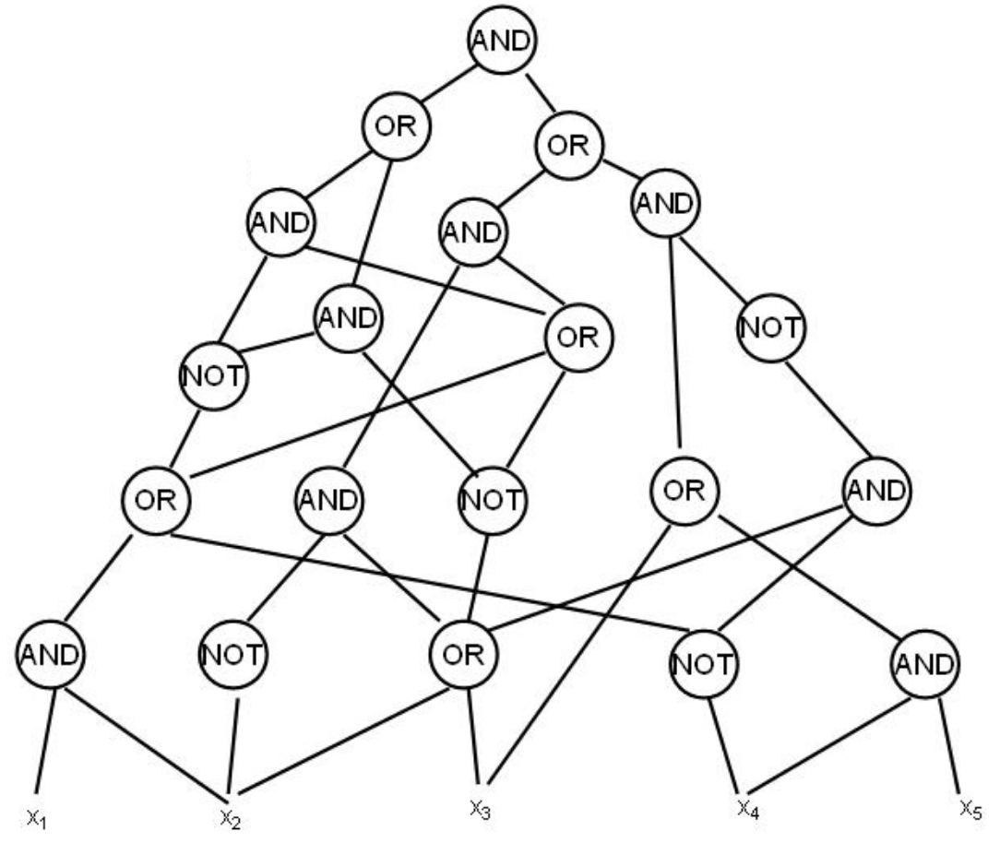

# NP-полные задачи

**Задача (полиномиально проверяемого) поиска** задается предикатом $C(I, S)$, где $I$ -- условие задачи, $S$ -- решение. Условие на них: размер решения является полиномом от размера условия, существует алгоритм $A_C(I, S)$, который по данному условию и решению за полиномиальное время вычисляет $C(I, S)$ (т.е. правильное решение или нет). Поиск гамильтонова цикла -- пример такой задачи.

Класс таких задач называется **NP**.

**Определение:** класс задач поиска, для которых также существует полиномиальный алгоритм $B_C(I) \rightarrow S$, который по условию выдает решение за полиномиальное время называется **P**.

Отсюда очевидно вытекает, что $P \subseteq NP$.

**Задача разрешения:** задача, которая проверяет, существует ли такое $S$, что $C(I, S)$.

**Утверждение:** если научиться решать задачу разрешения, то тогда научимся решать задачу поиска, т.е. по $I$ находить $S$ за полином.
**Доказательство:**
Допустим, у нас есть алгоритм $H$, который для графа $G$ говорит, есть в нем гамильтонов цикл или нет. Допустим, что в $G$ цикл есть. Тогда выкинем из $G$ ребро $e$ и скормим это алгоритму:
* в графе без ребра цикл есть. Тогда это ребро циклу не принадлежит
* в графе без ребра цикла нет. Тогда это ребро принадлежит циклу.
Эта штука называется **сводимость**.

### Всякие NP-полные задачи

| NP-полная задача                                                                                                           | Похожая задача, решать умеем                                                   |
|:---------------------------------------------------------------------------------------------------------------------------|:-------------------------------------------------------------------------------|
| Гамильтонов путь/цикл                                                                                                      | Эйлеров путь/цикл                                                              |
| Задача коммивояжера Существует ли путь стоимости $\leq k$?                                                              | Минимальное остовное дерево                                                    |
| Задача выполнимости (SAT) Есть конъюнкция дизъюнктов от $n$ (КНФ) переменных, надо найти выполняющий набор переменых | Выполнимость дизъюнктов Хорна Формула с дизъюнктами размер $\leq 2$ (2-SAT) |
| 3-выполнимость (3-SAT) Сложная, даже если любая переменная встречается $\geq 3$ раз                                     |                                                                                |
| Раскраска графа в $k\geq 3$ цветов                                                                                         | 2-раскраска графа                                                              |
| Целочисленное линейное программирование (ILP)                                                                              | Простое линейное программирование                                              |
| Поиск $k$-клики                                                                                                            |                                                                                |
| Поиск независимого покрывающего множества размера $k$                                                                      |                                                                                |
| Длиннейший путь в графе  (путь длины $\geq k$)                                                                             | Кратчайший путь                                                                |
| Сбалансированный разрез На размеры долей заданно соотношение                                                            | Минимальный разрез                                                             |

К слову, задача коммивояжера в классической постановке (найти минимальный путь) не принадлежит к NP, так как по данному пути за полином не проверить, что в графе нет путей меньшей стоимости.

**Великий вопрос P, NP и всего остального:** равны ли $P$ и $NP$? <i>вопрос на миллион</i>

## Сведение

Есть две задачи $A$ и $B$ с соответствующими предикатами: $C_A(I_A, S_A)$ и $C_B(I_B, S_B)$

Задача $A$ сводится к $B$ ($A \preceq B$) если существует полиномиально вычислимые функции $f: I_A\rightarrow I_B$ и $g: S_B \rightarrow S_A$ такие, что:
* для любого $I_A$ существование решения $\exists S_A:\ C_A(I_A, S_A) \Leftrightarrow \exists S_B:\ C_B(f(I_A), S_B)$
* $\forall I_A \forall S_B:\ \ C_A(I_A, g(S_B)) \Leftrightarrow C_B(f(I_A), S_B)$

Как решить $A$, умея решать $B$: берем условие $I_A$, превращаем его в $I_B$, решаем задачу $B$, ее результат перегоняем в решение $S_A$.

**Утверждение:** если $A$ решается за полином и $B$ сводится к $A$, то $A$ также решается за полином.

**Утверждение:** $A\rightarrow B,\ \ B\rightarrow C\Rightarrow A \rightarrow C$

**Определение:** задача $A$ называется **NP-трудной**, если любая другая задача из NP сводится к $A$, т.е. $A$ не проще никакой другой задачи из $NP$, при этом $A$ может и не принадлежать к $NP$.

**Опредление:** задача $A$ называется **NP-полной**, если $A\in NP$ и любая задача из $NP$ сводится к $A$.

Пример <i>NP-трудной</i> задачи -- коммивояжер в формулировке <i>найти минимальный путь</i>.

**Факт:** если $P\neq NP$, то существуют задачи из $NP\setminus P$, которые не являются NP-полными (т.е. не любу задачу из NP можно свести к ним) и наоборот. Претендентами на такие задачи являются факторизация числа на простые множители и проверка двух графов на изоморфизм.

### Теорема Кука-Левина

*Теорема Кука-Левина* гласит, что задача <i>Circuit SAT</i> NP-полна.

**Circuit SAT**

Надо проверить, есть ли набор переменных, дающих в итоге единичку.

Очевидно, что все задачи SAT семейства сводятся к Circuit SAT.

Пусть $A \in NP\Rightarrow\exists C_A(I_A, S_A)$ и алгоритм $\mathcal{A}$ для $C_A$

**Утверждение:** вычисление алгоритма $\mathcal{A}$ на входе длины $n$ можно записать схемой полиномиального размера за полиномиальное время. <i>просто поверьте в это. ключевые слова: компьютер, логическая схема</i>

По утверждению у нас получается некая схема, которая на вход принимает сколько-то битиков, соответствующих условию $I_A$, и еще сколько-то, соответствующих решению $S_A$.

Теперь нам нужна функция $f:I_A\rightarrow I_{SAT}$. Пусть эта задача захардкодим битики $I_A$ в схему, получим задачу для Circuit SAT.
Функция $g$ также простая: парсим значение для $S_A$ из получившихся битиков.

### Circuit SAT → SAT (3-SAT)

Для каждого гейта заводим переменную. Например, для гейта AND со входами $h_1$, $h_2$ заводим дизъюнкты $((h_1\land h_2)\to g), (g \to h_1), (g \to h_2)$.

Т.к. литералов всего 3, получили 3-SAT

### 3-SAT → Independent Set (IS)

Для каждого дизъюнкта строим треугольник из трех вершин, соответствующих переменным в дизъюнкте. Все $x$ соединим со всеми $\lnot x$ и т.д. Строим независимое множество. Если нашлось множество по размеру количества дизъюнктов, то бинго, мы нашли выполняющий набор (т.к. в независимом множестве не могут лежать одновременно $x$ и $\lnot x$). Если $x$ и $\lnot x$ не входят в независимое множество, то им можно приписать любое значение.
